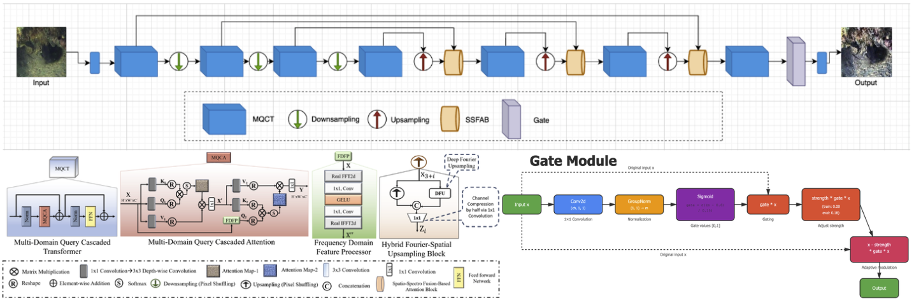
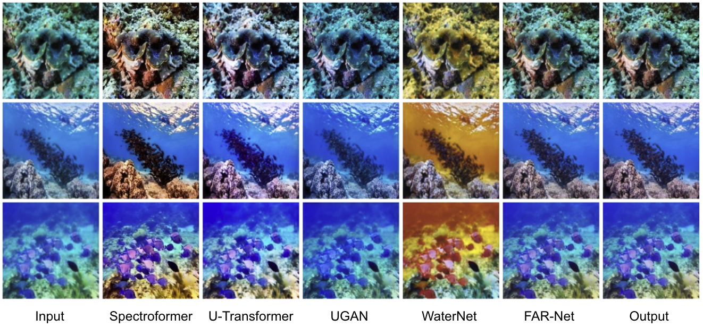
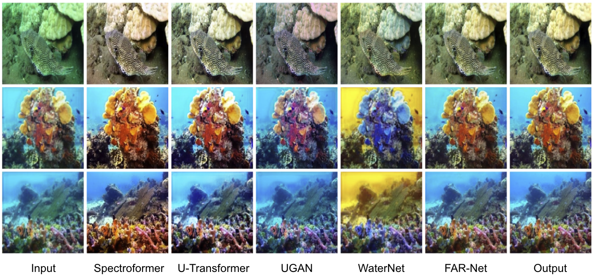

# FAR-Net: Frequency Augmented Restoration Network for Low-Weight Underwater Image Restoration

A lightweight underwater image restoration model that leverages frequency domain feature enhancement to achieve high-quality underwater image restoration with reduced computational complexity.


## Project Overview

Frequency Augmented Restoration (FAR) Net is a lightweight deep learning model specifically designed for underwater image restoration, building upon and significantly improving the Spectroformer architecture proposed in "[Spectroformer: Multi-Domain Query Cascaded Transformer Network for Underwater Image Enhancement](https://openaccess.thecvf.com/content/WACV2024/papers/Khan_Spectroformer_Multi-Domain_Query_Cascaded_Transformer_Network_for_Underwater_Image_Enhancement_WACV_2024_paper.pdf)" (WACV 2024). 

By introducing advanced frequency domain feature enhancement techniques and architectural optimizations, FAR-Net achieves substantial improvements over the original Spectroformer while maintaining a significantly reduced computational footprint. The model effectively addresses issues such as color cast, blur, and low contrast caused by underwater environments, generating clearer and more natural restored images with enhanced efficiency.


### Application Scenarios
- Underwater photography post-processing
- Marine ecological research image enhancement
- Underwater robot vision systems
- Marine archaeology image restoration

## Model Architecture


*Figure 1: Overall architecture of FAR-Net showing the frequency-augmented restoration pipeline.*


## Key Improvements Over Spectroformer

FAR-Net introduces several significant enhancements compared to the original Spectroformer :
- **Optimized Gate Mechanisms**: Advanced adaptive gating modules for better brightness and feature control
- **Enhanced Frequency Processing**: Improved frequency domain feature extraction and augmentation strategies
- **Efficient Feature Fusion**: Streamlined feature fusion strategies with lower memory footprint
- **Faster Inference**: Significant reduction in inference time suitable for real-time applications

## Visual Results





*Figure 2: Visual comparison of FAR-Net results on different underwater scenes.*

### Quantitative Results

#### LSUI Dataset

| Method | PSNR ↑ | SSIM ↑ |
|--------|--------|--------|
| Spectroformer | 24.39 | 0.86 |
| U-shaped | 25.65 | 0.89 |
| UGAN | 22.31 | 0.79 |
| WaterNet | 20.59 | 0.83 |
| **FAR-Net (Ours)** | **30.37** | **0.93** |

#### UIEB Dataset

| Method | PSNR ↑ | SSIM ↑ |
|--------|--------|--------|
| Spectroformer | 24.96 | 0.91 |
| U-shaped | 27.46 | 0.91 |
| UGAN | 21.57 | 0.85 |
| WaterNet | 21.46 | 0.85 |
| **FAR-Net (Ours)** | **32.36** | **0.94** |

*FAR-Net achieves significant performance improvements over baseline methods, with **+35.5% PSNR improvement** on LSUI and **+37.7% PSNR improvement** on UIEB compared to Spectroformer.*


## Folder Structure

```
FAR-Net/                
├── Train.py                    # Main training script
├── Final_model_AGSSF.py        # Final model definition (original version)
├── model_improve.py            # Improved model (with Gate module)
├── model.py                    # Base model
├── model_without_CA.py         # Version without channel attention
├── model_without_FU.py         # Version without feature fusion
├── network1.py                 # GAN network definition and loss functions
├── dataset.py                  # Dataset loader
├── data.py                     # Data processing utilities
├── data1.py                    # Data processing utilities
├── dataset1.py                 # Dataset loader
├── utils.py                    # Utility functions (PSNR, SSIM, VGG Loss, etc.)
├── uqim_utils.py               # Underwater image quality assessment tools
│
├── uw_data/                    # Training/Testing data (primary use)
│   ├── train/
│   │   ├── a/                  # Input images (raw underwater images)
│   │   └── b/                  # Target images (enhanced/reference images)
│   └── test/
│       ├── a/                  # Test input images
│       └── b/                  # Test target images
│
├── datasets/                   # Preprocessed test datasets
│   ├── UIEB/                   # Underwater Image Enhancement Benchmark
│   ├── UCCS/                   # Underwater Color Cast Set
│   ├── SQUID/                  # SQUID dataset
│   └── U-45/                   # U-45 dataset
│
├── checkpoints/                # Model checkpoint storage folder
│
├── images/                     # Visualization results during training
├── test/                       # Test phase output (auto-generated)
```


## Dataset Preparation

### Data Structure Requirements

Training data must be organized according to the following structure:

```
uw_data/
├── train/
│   ├── a/          # Input images (raw underwater images)
│   │   ├── image1.png
│   │   ├── image2.png
│   │   └── ...
│   └── b/          # Target images (enhanced reference images)
│       ├── image1.png
│       ├── image2.png
│       └── ...
└── test/
    ├── a/          # Test input images
    └── b/          # Test target images
```

**Note**: File names in the `a/` and `b/` folders must correspond one-to-one.


## Testing and Inference

### Test Datasets

The project includes test results on the following datasets:

| Dataset | Description | Results Location |
|---------|-------------|------------------|
| **UIEB** | Underwater Image Enhancement Benchmark | `Results/UIEB/` |
| **UCCS** | Underwater Color Cast Set | `Results/UCCS/` |
| **SQUID** | Underwater image dataset | `Results/SQUID/` |
| **U-45** | 45 underwater test images | `Results/U-45/` |

---

### Evaluation Metrics

Using evaluation functions from `utils.py`:
- **PSNR** (Peak Signal-to-Noise Ratio): `torchPSNR()`
- **SSIM** (Structural Similarity Index): `ssim()`
- **VGG Perceptual Distance**: `VGGPerceptualLoss()`


## Model Variants

The project includes multiple model variants for ablation studies:

| File | Description |
|------|-------------|
| `Final_model_AGSSF.py` | Original complete model (with AGSSF) |
| `model_improve.py` | **Improved version** (with Gate module for brightness control) |
| `model.py` | Base version |
| `model_without_CA.py` | Version with channel attention removed |
| `model_without_FU.py` | Version with feature fusion module removed |

It is recommended to use `model_improve.py` for training and testing.

